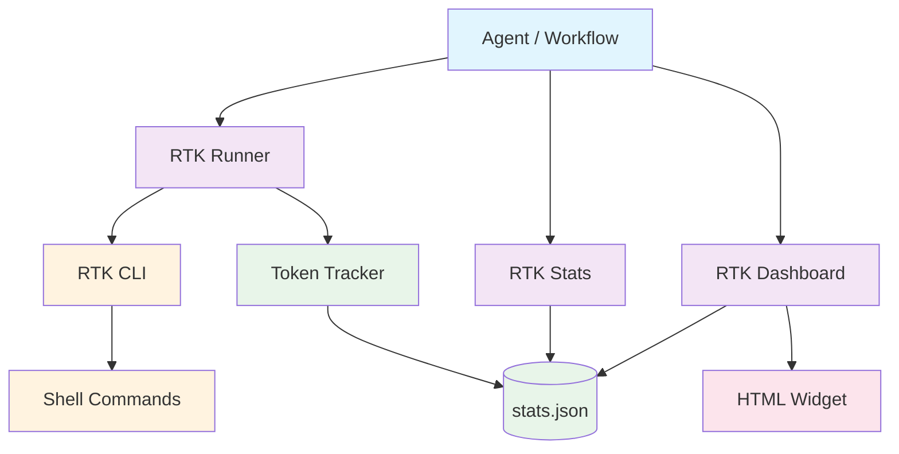
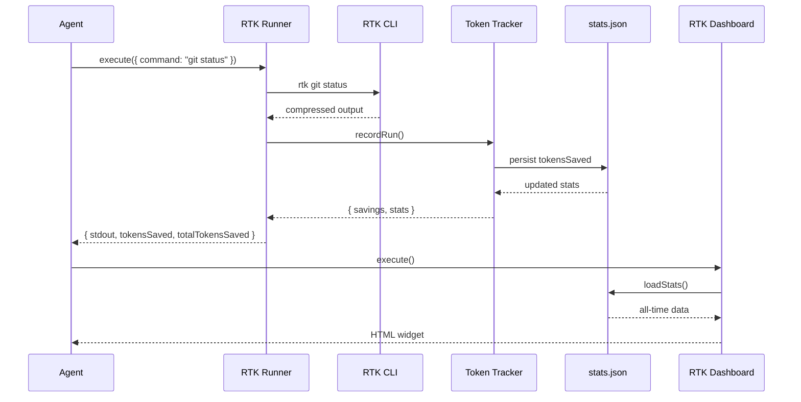

# RTK-AGNT Integration

[](https://github.com/unRekable/rtk-agnt-integration/actions)
[](https://opensource.org/licenses/MIT)
[](https://github.com/agnt-gg/agnt)

> AGNT plugin for [RTK (Rust Token Killer)](https://github.com/rtk-ai/rtk) with token savings tracking, stats utility, and theme-aware dashboard widget.





---

## What This Plugin Does

Runs shell commands through [RTK](https://github.com/rtk-ai/rtk) to compress output by **60-90%** before LLM ingestion.

**Supported RTK commands:** `git status`, `git log`, `git diff`, `cargo test`, `cargo build`, `docker ps`, `docker logs`, `kubectl get pods`, `ls`, `pytest`, `npm test`, `go test`

| Command | Raw Tokens | RTK Output | Savings |
|---------|-----------|------------|---------|
| `git status` | ~3,000 | ~600 | **-80%** |
| `cargo test` | ~25,000 | ~2,500 | **-90%** |
| `docker ps` | ~900 | ~180 | **-80%** |

---

## Prerequisites

RTK must be installed before using this plugin.

```bash
curl -fsSL https://raw.githubusercontent.com/rtk-ai/rtk/refs/heads/master/install.sh | sh
```

Verify: `rtk --version`

---

## Installation

1. Download `rtk-agnt-integration.agnt` from [Releases](https://github.com/unRekable/rtk-agnt-integration/releases/latest)
2. In AGNT: **Marketplace → Install from file** → select the `.agnt` file
3. Plugin hot-reloads automatically

---

## Tools

### RTK Runner (`rtk-runner`)

Executes shell commands via RTK with automatic token savings tracking.

**Parameters:**

| Parameter | Type | Required | Default | Description |
|-----------|------|----------|---------|-------------|
| `command` | `string` | ✅ | — | Shell command passed to RTK |
| `workingDirectory` | `string` | ❌ | `process.cwd()` | Execution directory |
| `ultraCompact` | `boolean` | ❌ | `false` | Adds `-u` flag for max compression |
| `rawFallback` | `boolean` | ❌ | `true` | Falls back to raw output if RTK unavailable |

**Returns:** `success`, `stdout`, `stderr`, `exitCode`, `tokensSaved`, `percentSaved`, `totalTokensSaved`, `totalRuns`

### RTK Stats (`rtk-stats`)

Retrieves token savings statistics.

**Parameters:**

| Parameter | Type | Required | Default | Description |
|-----------|------|----------|---------|-------------|
| `period` | `select` | ❌ | `all` | `all`, `today`, `week`, `month` |

**Returns:** `success`, `totalRuns`, `rtkRuns`, `fallbackRuns`, `totalTokensSaved`, `commands`, `history`

### RTK Dashboard (`rtk-dashboard`)

Renders a visual HTML widget with token savings charts.

**Parameters:** None

**Returns:** `html` (self-contained widget with stat cards, adoption ring, sparkline, bar chart)

---

## Token Tracking

All runs are recorded to `~/.rtk-agnt-stats/stats.json`:
- Total runs, RTK runs, fallback runs
- Tokens saved per run (cumulative)
- Per-command breakdown
- Last 100 executions

---

## Development

```bash
git clone https://github.com/unRekable/rtk-agnt-integration.git
cd rtk-agnt-integration
npm install
npm test
npm run build:plugin
```

## License

[MIT](LICENSE)
