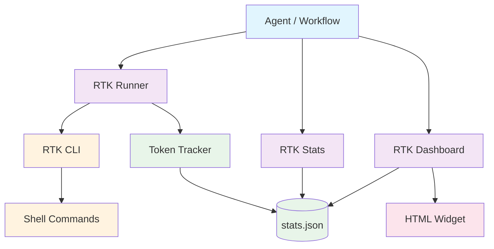
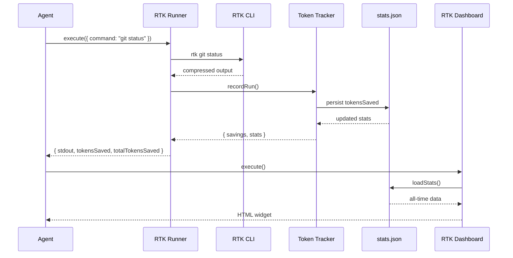

# RTK-AGNT Integration

[](https://github.com/unRekable/rtk-agnt-integration/actions)
[](https://opensource.org/licenses/MIT)
[](https://github.com/agnt-gg/agnt)

> AGNT plugin for [RTK (Rust Token Killer)](https://github.com/rtk-ai/rtk) with token savings tracking, stats utility, and theme-aware dashboard widget.





---

## Prerequisites

RTK must be installed before using this plugin.

```bash
curl -fsSL https://raw.githubusercontent.com/rtk-ai/rtk/refs/heads/master/install.sh | sh
```

Verify: `rtk --version`

---

## Installation

1. Download `rtk-agnt-integration.agnt` from [Releases](https://github.com/unRekable/rtk-agnt-integration/releases/latest)
2. In AGNT, go to **Marketplace → Install from file**
3. Select the downloaded `.agnt` file
4. The plugin installs and activates automatically

---

## Supported RTK Commands

This plugin supports all commands that RTK can compress. Here is the complete list:

| Category | Commands |
|----------|---------|
| **Git** | `git status`, `git log`, `git diff`, `git add`, `git commit`, `git push` |
| **Rust** | `cargo test`, `cargo build`, `cargo clippy` |
| **Docker** | `docker ps`, `docker logs`, `docker inspect` |
| **Kubernetes** | `kubectl get pods`, `kubectl logs` |
| **Python** | `pytest`, `ruff check` |
| **Go** | `go test` |
| **Node.js** | `npm test`, `jest` |
| **System** | `ls`, `tree`, `cat`, `grep`, `rg`, `read` |
| **Cloud** | `aws s3 ls`, `gh pr list` |

---

## Token Savings

| Command | Raw Tokens | RTK Output | Savings |
|---------|-----------|------------|---------|
| `git status` | ~3,000 | ~600 | **-80%** |
| `cargo test` | ~25,000 | ~2,500 | **-90%** |
| `docker ps` | ~900 | ~180 | **-80%** |
| `ls -la` | ~2,000 | ~400 | **-80%** |
| `pytest` | ~8,000 | ~800 | **-90%** |
| `go test` | ~6,000 | ~600 | **-90%** |

---

## Tools

### RTK Runner

Executes any shell command via RTK with automatic token savings tracking.

**Parameters:**

| Parameter | Type | Required | Default | Description |
|-----------|------|----------|---------|-------------|
| `command` | `string` | ✅ | — | Shell command to execute |
| `workingDirectory` | `string` | ❌ | `process.cwd()` | Execution directory |
| `ultraCompact` | `boolean` | ❌ | `false` | Maximum compression (`-u` flag) |
| `rawFallback` | `boolean` | ❌ | `true` | Use raw output if RTK unavailable |

**Returns:** `success`, `stdout`, `stderr`, `exitCode`, `tokensSaved`, `percentSaved`, `totalTokensSaved`, `totalRuns`

### RTK Stats

Retrieves token savings statistics.

**Parameters:**

| Parameter | Type | Required | Default | Description |
|-----------|------|----------|---------|-------------|
| `period` | `select` | ❌ | `all` | `all`, `today`, `week`, `month` |

**Returns:** `success`, `totalRuns`, `rtkRuns`, `fallbackRuns`, `totalTokensSaved`, `commands`, `history`

### RTK Dashboard

Renders a visual HTML widget with token savings charts.

**Parameters:** None

**Returns:** `html` (self-contained widget with stat cards, adoption ring, sparkline, bar chart)

---

## Import the Workflow

Copy and paste this JSON into AGNT Workflow Import:

```json
{
  "name": "RTK Token Optimizer",
  "description": "Execute shell commands via RTK with token savings tracking",
  "nodes": [
    {
      "id": "trigger-1",
      "type": "trigger",
      "config": { "triggerType": "manual" }
    },
    {
      "id": "runner-1",
      "type": "rtk-runner",
      "config": {
        "command": "git status",
        "ultraCompact": false,
        "rawFallback": true
      }
    },
    {
      "id": "stats-1",
      "type": "rtk-stats",
      "config": { "period": "all" }
    },
    {
      "id": "dashboard-1",
      "type": "rtk-dashboard",
      "config": {}
    }
  ],
  "edges": [
    { "source": "trigger-1", "target": "runner-1" },
    { "source": "runner-1", "target": "stats-1" },
    { "source": "stats-1", "target": "dashboard-1" }
  ]
}
```

---

## Token Tracking

All runs are recorded to `~/.rtk-agnt-stats/stats.json`:
- Total runs, RTK runs, fallback runs
- Tokens saved per run (cumulative)
- Per-command breakdown
- Last 100 executions

---

## Development

```bash
git clone https://github.com/unRekable/rtk-agnt-integration.git
cd rtk-agnt-integration
npm install
npm test
npm run build:plugin
```

## License

[MIT](LICENSE)
