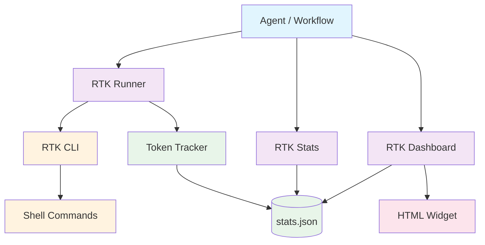

# RTK-AGNT Integration

[](https://github.com/unRekable/rtk-agnt-integration/actions)
[](https://opensource.org/licenses/MIT)
[](https://github.com/agnt-gg/agnt)

> AGNT plugin for [RTK (Rust Token Killer)](https://github.com/rtk-ai/rtk) with **token savings tracking**, **stats dashboard**, and **theme-aware widget**. Compress shell output by **60-90%** before it reaches your LLM context.

---

## Prerequisites

Before using this plugin, **RTK must be installed** on your system.

### Install RTK

```bash
# macOS / Linux
curl -fsSL https://raw.githubusercontent.com/rtk-ai/rtk/refs/heads/master/install.sh | sh

# or Homebrew
brew install rtk
```

Verify installation:
```bash
rtk --version
```

Expected output: `rtk x.x.x`

---

## Installation

### Step 1: Download the Plugin

Download the latest `rtk-agnt-integration.agnt` from [GitHub Releases](https://github.com/unRekable/rtk-agnt-integration/releases/latest).

### Step 2: Install in AGNT

1. Open AGNT
2. Navigate to **Marketplace**
3. Select **Install from file**
4. Choose the downloaded `rtk-agnt-integration.agnt` file
5. The plugin hot-reloads automatically

### Step 3: Verify Installation

Check that the plugin appears in your installed plugins list with version `4.0.0`.

---

## Usage

This plugin provides **3 tools** that can be used in AGNT Workflows.

### Tool 1: RTK Runner

**Purpose:** Execute shell commands through RTK to compress output by 60-90%.

**Required Parameter:**
- `command` (string): The shell command to execute

**Optional Parameters:**
- `workingDirectory` (string): Directory where the command runs
- `ultraCompact` (boolean): Enable maximum compression with `-u` flag
- `rawFallback` (boolean): Use raw output if RTK is not available

**Returns:**
- `success` (boolean): Execution status
- `stdout` (string): Compressed command output
- `stderr` (string): Error output
- `exitCode` (number): Shell exit code
- `tokensSaved` (number): Tokens saved on this run
- `percentSaved` (number): Percentage of tokens saved
- `totalTokensSaved` (number): Cumulative tokens saved across all runs
- `totalRuns` (number): Total number of executions

### Tool 2: RTK Stats

**Purpose:** Retrieve token savings statistics and command history.

**Required Parameter:**
- `period` (select): Time period filter — options: `all`, `today`, `week`, `month`

**Returns:**
- `success` (boolean)
- `totalRuns` (number)
- `rtkRuns` (number)
- `fallbackRuns` (number)
- `totalTokensSaved` (number)
- `commands` (object): Per-command breakdown
- `history` (array): Last 100 execution records

### Tool 3: RTK Dashboard

**Purpose:** Visual HTML widget showing token savings with charts.

**Parameters:** None

**Returns:**
- `html` (string): Self-contained HTML widget with stat cards, adoption ring, sparkline, and bar chart

---

## Building a Workflow

1. Go to **Workflows → New Workflow**
2. Add a **Trigger** node
3. Add **RTK Runner** — fill in the `command` parameter with your shell command
4. Add **RTK Stats** — select the desired `period`
5. Add **RTK Dashboard** — no configuration required
6. Connect the nodes: Trigger → Runner → Stats → Dashboard
7. Click **Run**

---

## Architecture



---

## Token Tracking

Every execution is automatically recorded to:

```
~/.rtk-agnt-stats/stats.json
```

Tracked metrics:
- Total runs, RTK runs, fallback runs
- Tokens saved per run and cumulative
- Per-command breakdown
- Last 100 runs history

This data persists across AGNT restarts.

---

## Development

```bash
# Clone
git clone https://github.com/unRekable/rtk-agnt-integration.git
cd rtk-agnt-integration

# Install dependencies
npm install

# Run tests
npm test

# Build plugin package
npm run build:plugin
```

---

## License

[MIT](LICENSE) © RTK-AGNT Integration Contributors
