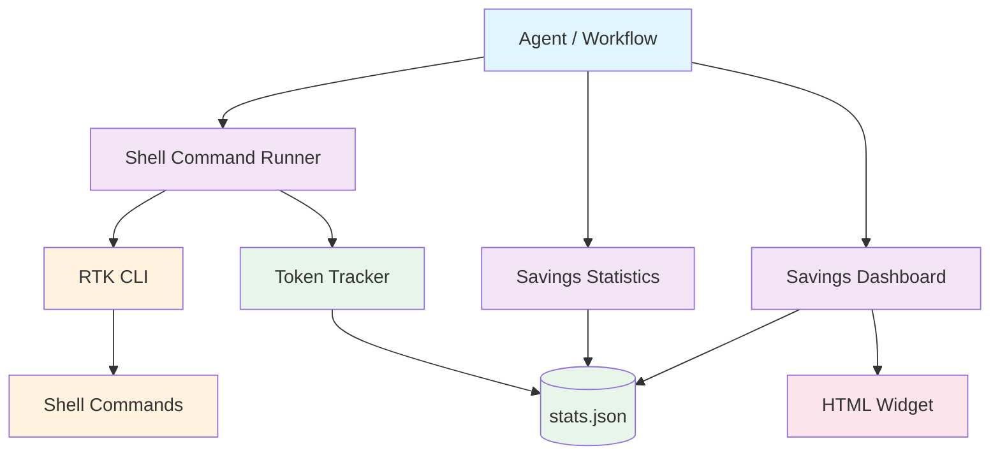
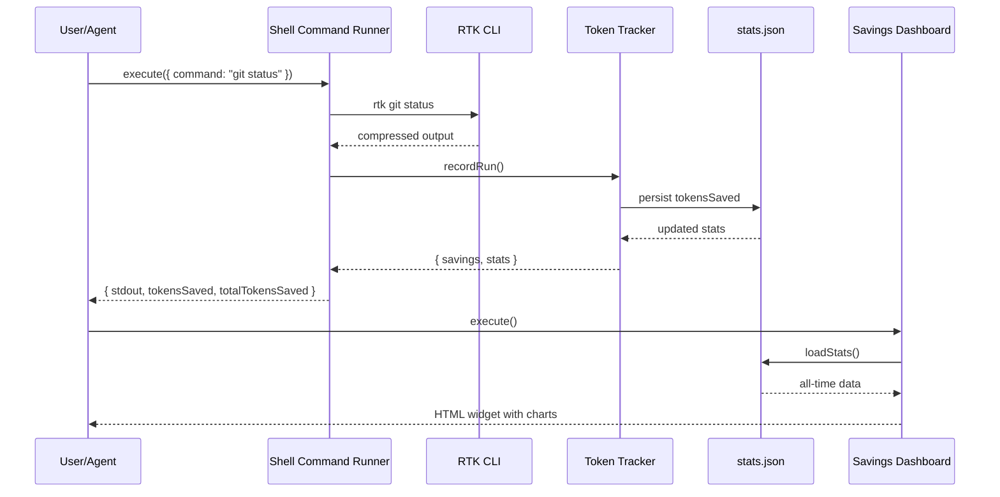

# RTK-AGNT Integration

[](https://github.com/unRekable/rtk-agnt-integration/actions)
[](https://opensource.org/licenses/MIT)
[](https://github.com/agnt-gg/agnt)

> AGNT plugin for [RTK (Rust Token Killer)](https://github.com/rtk-ai/rtk) with **token savings tracking**, **stats dashboard**, and **theme-aware widget**. Compress shell output by **60-90%** before it reaches your LLM context.

---

## Architecture



### Data Flow



---

## Quick Start

### Prerequisites

- **Node.js** >= 18.0.0
- **AGNT** running locally ([install guide](https://github.com/agnt-gg/agnt))
- **RTK** (optional but recommended):
  ```bash
  # macOS / Linux
  curl -fsSL https://raw.githubusercontent.com/rtk-ai/rtk/refs/heads/master/install.sh | sh

  # or Homebrew
  brew install rtk
  ```

### Install the Plugin

1. Download [`rtk-agnt-integration.agnt`](https://github.com/unRekable/rtk-agnt-integration/releases/latest) from Releases
2. In AGNT: **Marketplace → Install from file** → select the `.agnt` file
3. The plugin hot-reloads automatically

### Build Your First Workflow

1. Go to **Workflows → New Workflow**
2. Add a **Webhook Trigger**, **Time Trigger**, or **Email Receiver Trigger** node
3. Add **Shell Command Runner** → set your command
4. Add **Savings Statistics** → set `period` to `all`
5. Add **Savings Dashboard** → no parameters needed
6. Connect: Trigger → Runner → Stats → Dashboard
7. Click **Run**

After running, you will see:
- **Runner output**: Command output (compressed via RTK if installed, raw otherwise)
- **Stats output**: Total runs, tokens saved, command history
- **Dashboard output**: Visual HTML widget with stat cards, charts, and sparklines

---

## What Is This?

This project bridges [RTK](https://github.com/rtk-ai/rtk) — a high-performance CLI proxy written in Rust — with [AGNT](https://github.com/agnt-gg/agnt), the local-first AI agent operating system.

Instead of dumping raw `git status`, `cargo test`, or `docker ps` output into your LLM prompt (burning thousands of tokens), this plugin pipes everything through RTK first. You get the same information, just condensed and optimized.

### Token Savings

| Command | Raw Tokens | RTK Output | Savings |
|---------|-----------|------------|---------|
| `git status` | ~3,000 | ~600 | **-80%** |
| `cargo test` | ~25,000 | ~2,500 | **-90%** |
| `docker ps` | ~900 | ~180 | **-80%** |
| `ls -la` | ~2,000 | ~400 | **-80%** |

---

## Installation

### Option A: Install from GitHub Releases

1. Download the latest `.agnt` file from [Releases](https://github.com/unRekable/rtk-agnt-integration/releases).
2. In AGNT: **Marketplace → Install from file** → select the `.agnt` file.
3. Done. The plugin hot-reloads automatically.

### Option B: Install from Source

```bash
# Clone the repository
git clone https://github.com/unRekable/rtk-agnt-integration.git
cd rtk-agnt-integration

# Install dependencies & run tests
npm install
npm test

# Build and install plugin into AGNT
npm run build:plugin
npm run install:agnt
```

---

## Tools

This plugin provides **3 tools** for AGNT:

### 1. Shell Command Runner (`rtk-runner`)

Executes shell commands through RTK with automatic token savings tracking.

**Parameters:**

| Parameter | Type | Required | Default | Description |
|-----------|------|----------|---------|-------------|
| `command` | `string` | ✅ | — | Shell command (e.g. `git status`, `cargo test`) |
| `workingDirectory` | `string` | ❌ | `process.cwd()` | Directory to run in |
| `ultraCompact` | `boolean` | ❌ | `false` | Maximum compression (`-u` flag) |
| `rawFallback` | `boolean` | ❌ | `true` | Fall back to raw if RTK missing |

**Example:**
```json
{
  "command": "git status",
  "ultraCompact": false
}
```

**Response:**
```json
{
  "success": true,
  "rtkInstalled": true,
  "exitCode": 0,
  "stdout": "M  src/file.js\n?? new.txt",
  "tokensSaved": 1800,
  "percentSaved": 75,
  "totalTokensSaved": 45200,
  "totalRuns": 42,
  "note": "Output filtered via RTK for token optimization"
}
```

---

### 2. Savings Statistics (`rtk-stats`)

Retrieve token savings statistics and command history.

**Parameters:**

| Parameter | Type | Default | Description |
|-----------|------|---------|-------------|
| `period` | `select` | `all` | Filter: `all`, `today`, `week`, `month` |

**Response:**
```json
{
  "success": true,
  "totalRuns": 42,
  "rtkRuns": 40,
  "fallbackRuns": 2,
  "totalTokensSaved": 45200,
  "commands": {
    "git": { "count": 15, "tokensSaved": 18000 },
    "cargo": { "count": 8, "tokensSaved": 22000 }
  },
  "history": [ ... ]
}
```

---

### 3. Savings Dashboard (`rtk-dashboard`)

Interactive token savings dashboard with charts and visualizations. **Theme-aware** — automatically adapts to AGNT's dark/light mode.

**Returns:** Self-contained HTML widget with:
- Live stat cards (total runs, tokens saved, RTK runs, fallbacks)
- RTK adoption rate ring chart
- Token savings trend sparkline
- Top commands bar chart

The dashboard uses AGNT CSS variables (`--color-bg`, `--color-accent`, etc.) for automatic theme adaptation.

---

## Token Tracking

Every run is automatically recorded to a local JSON file:

```
~/.rtk-agnt-stats/stats.json
```

Tracked metrics:
- Total runs, RTK runs, fallback runs
- Tokens saved per run and cumulative
- Per-command breakdown
- Last 100 runs history

This data persists across AGNT restarts and is used by both `Savings Statistics` and `Savings Dashboard`.

---

## Development

```bash
# Clone
git clone https://github.com/unRekable/rtk-agnt-integration.git
cd rtk-agnt-integration

# Install
npm install

# Run tests
npm test

# Watch mode
npm run test:watch

# Lint
npm run lint

# Build plugin package
npm run build:plugin
```

### Project Structure

```
rtk-agnt-integration/
├── .github/workflows/       # CI/CD pipelines
├── __tests__/               # Test suite
│   ├── index.test.js        # Core library tests
│   ├── rtk-stats.test.js    # Stats tool tests
│   └── rtk-dashboard.test.js # Dashboard tests
├── bin/                     # CLI helpers
│   ├── build-plugin.js      # Build .agnt package
│   └── install-to-agnt.js   # Install to local AGNT
├── plugin/                  # AGNT plugin files
│   ├── manifest.json        # Plugin metadata (3 tools)
│   ├── rtk-runner.js        # Runner tool
│   ├── rtk-stats.js         # Stats tool
│   └── rtk-dashboard.js     # Dashboard widget tool
├── src/                     # Core library
│   └── index.js             # Shared: tracking, persistence
├── jest.config.cjs          # Jest config (CommonJS)
├── .eslintrc.cjs            # ESLint config (CommonJS)
├── package.json             # ESM project manifest
├── CONTRIBUTING.md          # Contribution guide
├── LICENSE                  # MIT
└── README.md                # This file
```

### ESM / CJS Split

| Context | Extension | Reason |
|---------|-----------|--------|
| Source code | `.js` | ES Modules (`"type": "module"`) |
| Plugin code | `.js` | ES Modules (AGNT requirement) |
| Jest config | `.cjs` | CommonJS (Jest doesn't read ESM config) |
| ESLint config | `.cjs` | CommonJS (same reason) |
| Tests | `.test.js` | ESM (Jest with `--experimental-vm-modules`) |

---

## Testing

This project follows **Test-Driven Development (TDD)**.

- **Unit tests:** `__tests__/*.test.js` — Jest with ESM
- **Coverage threshold:** 80% branches, functions, lines, statements
- **CI:** GitHub Actions runs tests on Node 18, 20, 22

```bash
npm test
```

---

## CI/CD

| Workflow | Trigger | Purpose |
|----------|---------|---------|
| `ci.yml` | Push/PR to `main` | Tests, lint, plugin build verification |
| `release.yml` | Git tag `v*.*.*` | Build plugin + create GitHub Release |

---

## Contributing

See [CONTRIBUTING.md](CONTRIBUTING.md) for:
- TDD workflow
- Commit conventions (Conventional Commits)
- Coverage requirements
- Plugin architecture

---

## License

[MIT](LICENSE) © RTK-AGNT Integration Contributors

---

## Acknowledgments

- [RTK (Rust Token Killer)](https://github.com/rtk-ai/rtk) by the RTK team
- [AGNT](https://github.com/agnt-gg/agnt) by the AGNT team
